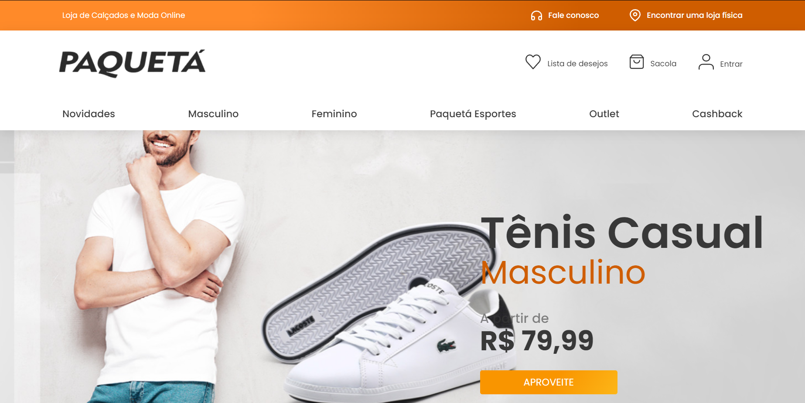

<h1 align="center">Projeto - Paquetá Calçados</h1>

<p align="center">
Desenvolvimento do projeto <strong>Paquetá Calçados</strong> como parte do desafio do BR Challenges.
<br>
</p>

<p align="center">
  <a href="#-tecnologias">Tecnologias</a>&nbsp;&nbsp;&nbsp;|&nbsp;&nbsp;&nbsp;
  <a href="#-projeto">Projeto</a>&nbsp;&nbsp;&nbsp;|&nbsp;&nbsp;&nbsp;
  <a href="#-como-rodar-o-projeto">Como Rodar</a>&nbsp;&nbsp;&nbsp;|&nbsp;&nbsp;&nbsp;
  <a href="#memo-licença">Licença</a>
</p>

<p align="center">
  
</p>

<br>

<p align="center">
  
</p>

## 🚀 Tecnologias

Esse projeto foi desenvolvido com as seguintes tecnologias:

- **Next.js**
- **TailwindCSS**
- **TypeScript**
- **Zustand** (gerenciamento de estado global)
- **Auth.js** (autenticação com Google e persistência de sessão)
- **shadcn/ui** (componentes de UI como modais, sheets e toasts)

## 💻 Projeto

Este projeto foi desenvolvido como parte do desafio do **BR Challenges**.  
O objetivo foi construir uma interface responsiva e funcional baseada no design do **Figma**, adicionando funcionalidades extras para aprimorar a experiência do usuário.  

### 🔹 Funcionalidades:
- Listagem de produtos consumindo API do BR Challenges
- Carrinho de compras com adição e remoção de itens
- Lista de favoritos para salvar produtos desejados
- Autenticação com Google usando **Auth.js**
- Gerenciamento de estado global eficiente com **Zustand**
- Interface fiel ao design, desenvolvida com **TailwindCSS** e **shadcn/ui**

🔗 **[Acesse o projeto online](#)**  
🔗 **[Repositório no GitHub](#)**  

## 📦 Como Rodar o Projeto

💻 **Clone o repositório**  
```sh
git clone https://github.com/charlesalmeiida/paqueta-calcados.git
```

📂 **Entre no diretório**

```sh
cd paqueta-calcados
```

📦 **Instale as dependências**

```sh
npm install
# ou
yarn install
```

🔗 **O projeto estará disponível em http://localhost:3000**

📝 **Licença**
Esse projeto está sob a licença MIT. 

📌 Obs.: Este projeto tem foco exclusivamente educacional e não possui vínculo com a empresa Paquetá Calçados.